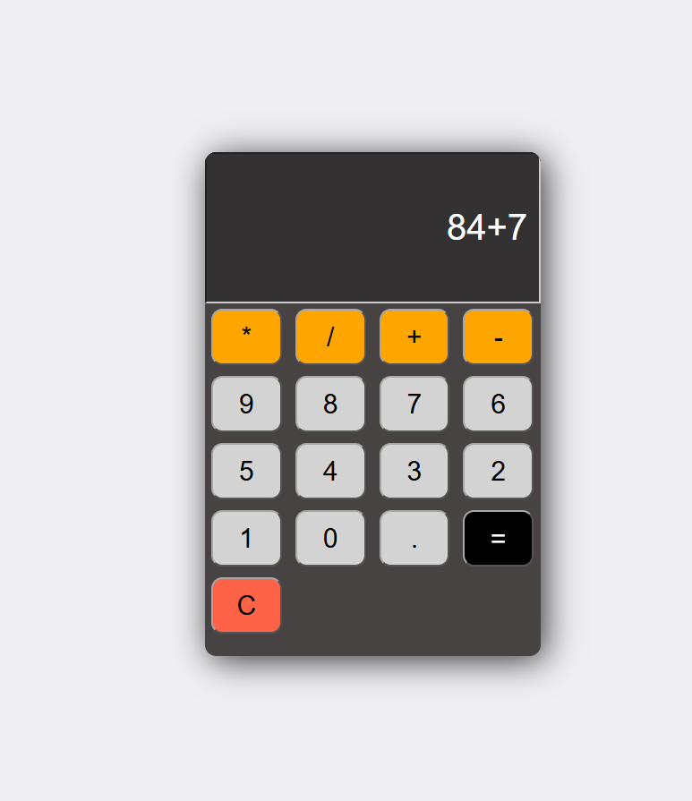

# 🧮 A Simple Calculator


<div align="center">

### ✨ A clean, simple, and interactive calculator built with HTML, CSS & JavaScript

Perform everyday arithmetic calculations directly in your browser.

<br>


</div>

---

## 📖 About the Project

**A Simple Calculator** is a lightweight web application created using **HTML, CSS, and JavaScript**.

It provides an easy-to-use interface for performing basic mathematical calculations. The project demonstrates how HTML can be used to structure a web application, CSS to create an attractive user interface, and JavaScript to add functionality and interactivity.

Whether you want to add two numbers, calculate a product, or quickly divide some values, this calculator has you covered. 🚀

---

## ✨ Features

➕ **Addition** — Add two or more numbers.

➖ **Subtraction** — Calculate the difference between numbers.

✖️ **Multiplication** — Multiply numbers together.

➗ **Division** — Divide one number by another.

🧹 **Clear Functionality** — Reset the calculator and start a new calculation.

⚡ **Instant Results** — Calculations are performed immediately using JavaScript.

🎨 **Simple UI** — Clean and easy-to-understand calculator interface.

🌐 **Browser Based** — No installation or additional software required.

---

## 🛠️ Built With

| Technology       | Purpose                                    |
| ---------------- | ------------------------------------------ |
| 🌐 **HTML5**     | Defines the structure of the calculator    |
| 🎨 **CSS3**      | Styles the calculator and its buttons      |
| ⚡ **JavaScript** | Handles calculations and user interactions |

---

## 🧮 Supported Operations

The calculator supports the most commonly used arithmetic operations:

```text
Addition        →  10 + 5 = 15

Subtraction     →  10 - 5 = 5

Multiplication  →  10 × 5 = 50

Division        →  10 ÷ 5 = 2
```

---

## 🚀 Getting Started

You can run the calculator locally in just a few steps.

### 1️⃣ Clone the Repository

```bash
git clone https://github.com/sharmaji6880/A-Simple-Calculator.git
```

### 2️⃣ Navigate to the Project

```bash
cd A-Simple-Calculator
```

### 3️⃣ Open the Application

Open the `index.html` file in your preferred web browser.

That's it! 🎉

No packages, frameworks, servers, or additional dependencies are required.

---

## 📂 Project Structure

```text
A-Simple-Calculator/
│
├── 📁 assets/
│   └── 🖼️ calculator-preview.png
│
├── 📄 index.html
├── 🎨 style.css
├── ⚡ script.js
└── 📖 README.md
```

### What does each file do?

**`index.html`**
Contains the structure and buttons of the calculator.

**`style.css`**
Contains the styling responsible for the appearance and layout of the calculator.

**`script.js`**
Contains the JavaScript logic used to perform calculations and handle user interactions.

**`README.md`**
Contains information and documentation about the project.
**`assets/calcualtor-preview.png`**
Contains the preview of the Calculator application.

---

## 💡 How It Works

The calculator takes input through the buttons displayed on the interface.

When the user selects numbers and an arithmetic operator, JavaScript processes the input and displays the calculated result.

```text
User Input
    ↓
Calculator Buttons
    ↓
JavaScript Logic
    ↓
Arithmetic Operation
    ↓
Result Displayed
```

---

## 📸 Screenshots

<p align="center">
  
</p>


## 🎯 What I Learned

Building this project helped strengthen my understanding of:

* Structuring web pages using **HTML**
* Designing interfaces using **CSS**
* Handling button click events with **JavaScript**
* Working with arithmetic operations programmatically
* Updating webpage content dynamically using the **DOM**
* Connecting HTML, CSS, and JavaScript to build an interactive application

---

## 🔮 Future Improvements

Some features that could be added in the future include:

* 🌙 Dark and light mode
* ⌨️ Keyboard input support
* 📱 Improved responsive design
* 🧠 Scientific calculator functions
* 📜 Calculation history
* 💾 Saving previous calculations
* 🎨 Additional calculator themes
* 🔢 Decimal and percentage operations

---

## 🤝 Contributing

Contributions, suggestions, and improvements are welcome!

If you'd like to improve the project:

```text
1. Fork the repository
2. Create a new branch
3. Make your changes
4. Commit your changes
5. Push your branch
6. Open a Pull Request
```

---

## ⭐ Support

If you found this project useful or liked the design, consider giving the repository a **⭐ star**.

It helps support the project and motivates further improvements!

---

<div align="center">

### 🧮 Simple. Fast. Easy to Use.

**Built with ❤️ using HTML, CSS & JavaScript**

</div>

